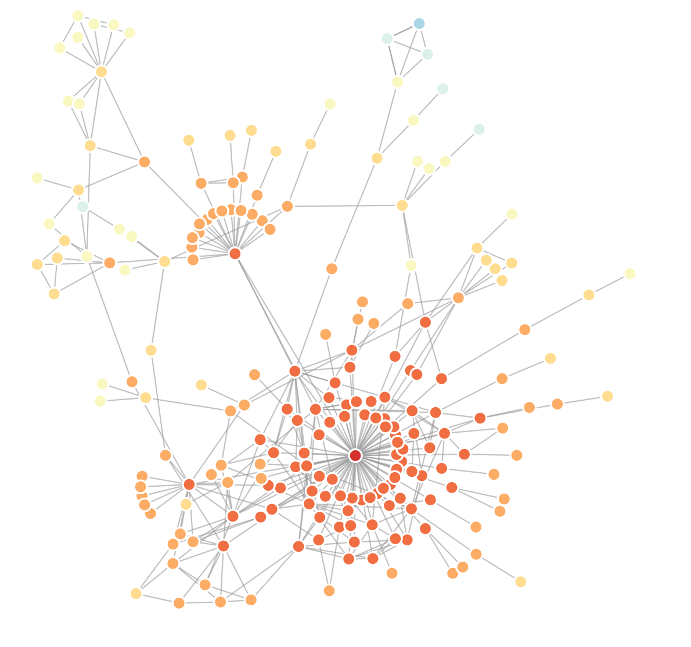

# deptree

This is a little server that will visualize the dependency tree of any `latest` package in npm. The output looks like this:

To use, run `npm install` and then `npm start`, then visit [the demo page](http://localhost:8080/public/index.html).
